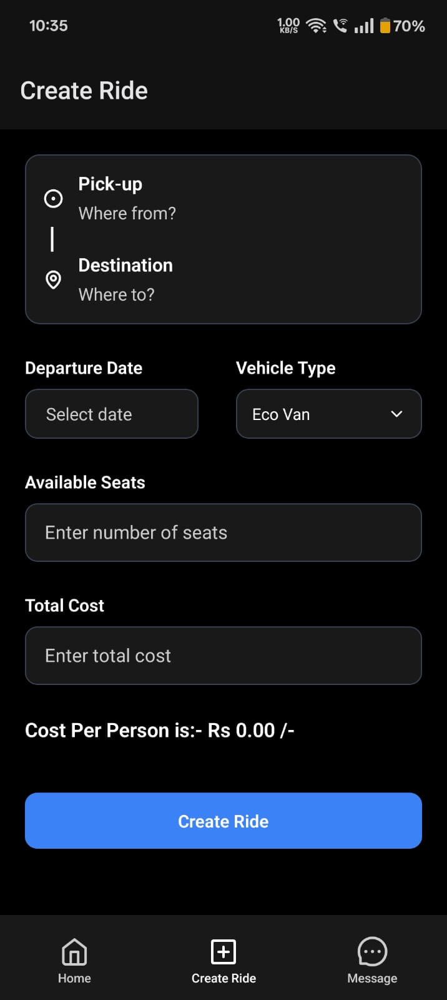
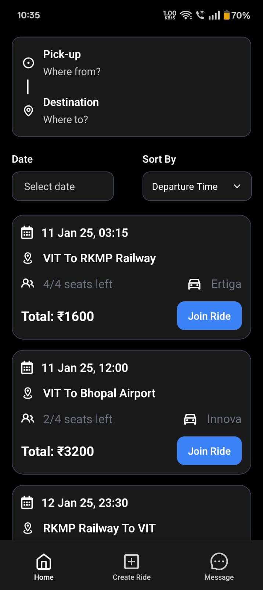
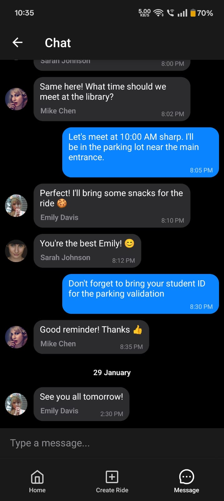

<div align="center">


# Karpool

### Student Ride-Sharing for Campus Communities

[](https://expo.dev/)
[](https://reactnative.dev/)
[](https://www.typescriptlang.org/)
[](https://supabase.com/)

</div>

A campus carpool app: students create rides, others join, members coordinate via realtime group chat.

## Screenshots

<div align="center">
<table>
  <tr>
    <td></td>
    <td></td>
    <td></td>
  </tr>
</table>
</div>

## Stack

| Layer | Tools |
|---|---|
| **Framework** | Expo SDK 54, React Native 0.81, React 19, TypeScript (strict) |
| **Routing** | Expo Router 6 (file-based, typed routes) |
| **Backend** | Supabase — Postgres, Auth, Realtime |
| **Data** | TanStack Query, Postgres RPCs for atomic multi-row writes |
| **UI** | FlashList v2, react-native-gifted-chat, Reanimated, React Compiler |

## Database

Four tables: `users`, `rides`, `bookings`, `messages`.

| Table | Key Constraints |
|---|---|
| `rides` | `status ∈ {active, archived}` · `total_cost > 0` · `0 ≤ available_seats ≤ total_seats` · `departure_date > created_at` · `cost_per_person` is a generated column |
| `bookings` | `UNIQUE (ride_id, user_id)` — prevents double-booking |
| `messages` | FK to `rides.id` and `users.id` |
| `users` | unique `email`, unique `phone`, `id` is FK to `auth.users` |

Generated TS types: [src/database.types.ts](src/database.types.ts) (UTF-16; regenerate with `npx supabase gen types typescript ...`).

## Getting Started

```bash
npm install
```

Create `.env`:

```
EXPO_PUBLIC_SUPABASE_URL=...
EXPO_PUBLIC_SUPABASE_PUBLISHABLE_KEY=...
```

| Command | Platform |
|---|---|
| `npm start` | Expo dev server |
| `npm run android` | Android emulator |
| `npm run ios` | iOS simulator |
| `npm run web` | Browser |
| `npx tsc --noEmit` | Type-check (no test runner is wired up) |

## Roadmap

| Status | Items |
|---|---|
| ✅ Done | Auth, ride CRUD, atomic join/leave/create, realtime chat, upcoming/past chat list, ride info screen, light/dark mode |
| 🚧 Next | Row-Level Security policies, profile screen + avatar uploads, push notifications, chat pagination |
